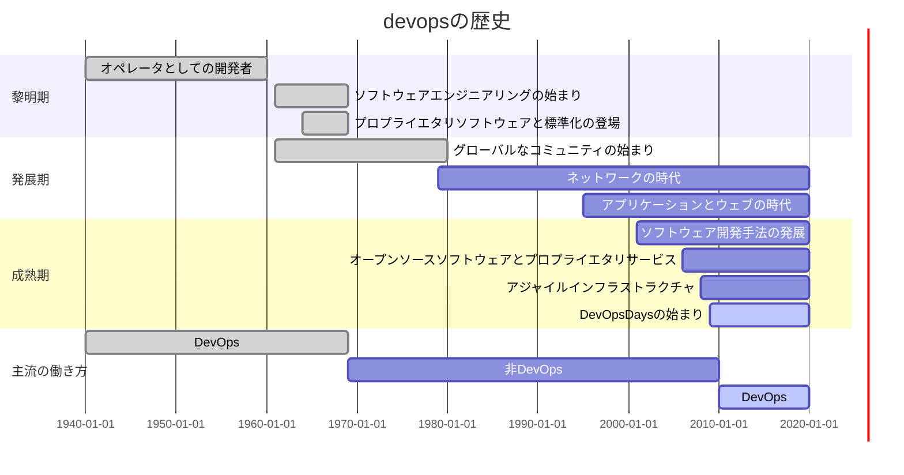

# 第I部 devops とはなにか

タイトルの「大局」とは、価値に着目した活動ができているか、ということ。
ツールばかりにとらわれると、これがおろそかになってしまう。

### 1.1 devops 文化のスナップショット
優れた技術と文化を兼ね備える米国企業の例:
- 必須ツールのインストールが完了されたマシンの配布
- カスタマイズの自由
- メンター制度
- コミット安全な開発環境
- 本番環境を模したテスト環境での継続的インテグレーション
- レビュー文化（要不要は個人の判断、なるほど）
- 徹底的につながった知的財産: コミットからデプロイはもちろん、当直電話まで！
- 健全なポストモーテム
- 初心者へのコミット機会の提供（写真をコミット、なるほど）
- 60デプロイ/day

### 1.2 文化の発展の経緯
1.1 で描写されていた企業の文化はこの上なく模範的だが、はじめは苦労していたようだ:
- 信頼性の低いテスト
- サイロ化
- 3週間ごとのドッカンデプロイ

鬱憤がたまった社員たちが、ボトムアップで改善したようだ。ここはさすがエンジニアだ。
改革にはどうしても資金が入用となるので、彼らは CEO と CTO に相談したようだ。
やはり上層部の支持は重要なのか。

運用エンジニアが開発エンジニアと手を結び、社内向けデプロイツールを開発した。
デプロイのイメージ刷新---月に一度の嫌なものではなく、ユーザーに価値を届ける手段---につながった。

これらの改革のカギは、ツールではない。
まず改善の必要性に気づいた人がいたこと。
そして彼らが環境に恵まれていたからだ:
- 経営陣の支持
- 內部向けツール開発への理解（stockdbrのこと）
- 周囲からの信頼
（どれも不可欠なんだな...）

どんなレベルでもこの文化を維持することが重視されている
（水研でいえば、チーム、グループ、部、所、機構、というレベルだろう。すばらしい）
devops とは、以下のような事項に影響を与える文化的改革を大切にする組織だ（ここでの devops の使われ方はおもしろい）:
- 個人が仕事をどのように考えるか（この本で学べる）
- さまざまな職務をどのように尊重するか（この本で学べる）
- ビジネス価値をどのように高めるか（『アジャイルな見積もりと計画づくり』に少し書いてある。他にもっといい本があると思う）
- 改革の効果をどのように計測するか（これはかなりストイック...）
（私達の組織はどうだろうか?）
（用語に明確な対応関係はないが、ひょっとして、これらは本書が着目する4本柱だろうか）

### 1.3 ストーリーの価値
続く節では、理論ではなく、実際のケーススタディが紹介される。
「うまくいかなかったこと」も書いてあるみたい。

### 1.4 リンのストーリー
第1著者リンは、devops という概念が産まれたころにちょうどキャリアをスタートさせた。
彼女はもともと devops 的価値観を持ったタイプだったが、入社したスタートアップは残念ながら旧態依然な体質だったようだ。
スタートアップをよりよくしようと努力したが、周りとうまく噛み合わなかった。
New York で開催された devops カンファレンスでの人脈をきっかけに、彼女は Etsy へ転職した。
彼女が本書の執筆を思い立った理由:
- キャリアを変えてくれたコミュニティへの恩返しのため
- 組織の単一障害点としてのプレッシャーを感じている人を救うため

### 1.5 ジェニファーのストーリー
彼女のストーリーから我々が学ぶべきことは、スーパーマンによって回っている組織の弱さだ。
本文 p.9 を読むと良い。

コミュニティとしての成長。
失敗と成長から学ぶこと。

---水研はどうだろうか？

### 1.6 devops をストーリーで説明する
本書にはたくさんのストーリーが載っているが、コンテクストも冷静に見つめること。
ただ猿真似しても、効果は出ない。
ちゃんと考えた上でなら、どんどん試すといい。
ただし、必ず効果を計測し、うまくいったかどうかを評価して、学ぶこと。

## 第２章 devopsとは何か

> "devops"は文化運動だ。（p.13）
> "devopsは思考の方法であり、仕事の方法でもある" (p.13)


### 2.1 文化のための処方箋

- devopsはそれ自体が利益となるものではなく、物事を改善するための処方箋（改善策？）
- devopsは文化運動
  - 価値観
  - 基準
  - 信念
  - 作為
- devopsとは効率的に仕事をするために、社会構造、文化、技術を革新する方法を見つけること。

```
【水研の場合】

社会構造の革新：サイロ化の解消とオンプレミスからの脱却
文化の革新：資源評価報告書文化からmdによる簡潔な報告書へ、そしてTidyデータによるデータハンドリング
技術の革新：ExcelWordからRとプレーンテキストへ
```

### 2.2 devopsの方程式

```
"自分のことを新しいと思っている運動には、古くないすべてのものを支持しようとする危険性がある
 (リー・ロイ・ビーチ他「Natuiralistic Decision Making and Related Research Lines」) (p.13)"
```

- 本書は「唯一無二の正しい方法」を示すものではない
- 誤解やアンチパターンも大事だが、成功例がどのように機能したかが重要
- devopsは開発(dev)と運用（Ops)のみならず組織全体に応用すべき
  - 思考を開発と運用チームのみに限定してはいけない。そのような運動はdevopsではないし、むしろ **害** を与える

```
【水研の場合】

「devopsは新しく革新的な文化だから良いものだ！」と言っているよあの人たち・・・

と思われないことが大事。新しいものが良いわけでない。良さを相手の視線に合わせて伝える必要がある。
```

### 2.2.1 通俗モデルとしてのdevops

```
【通俗】

世間一般の人々にわかりやすく親しみやすいこと。一般向きであること。また、そのさま。
（小学館 デジタル大辞林）
```

- devopsという言葉は普及したが、そのぶん不用意に使われるようにもなった
- なんとなく雰囲気としてわかる
- しかしdevopsは抽象的な考え
  - 定義は人によってさまざま
- devopsを定義するより、**devopsがもたらす効能** について語るべきであろう
　- どんなに良いものであっても、それが可視化できないと人はついてこない

### 2.2.2 古い見方と新しい見方

会社には古い見方と新しい見方がある

- 古い見方(非難文化)
  - ヒューマンエラーは属人問題
  - 腐ったリンゴが問題を犯す
  - ミスを犯す問題or人を除去・修正することで対応

- 新しい見方(devops文化)
  - ヒューマンエラーは構造問題
  - システムに問題があるから人はエラーを犯す
  - 合理的に問題を把握し修正することで対応

新しい文化ではすべてのことが **学習機会** となる。
- チーム内の透明性向上、信頼向上
- ダメージコントロールと防止
- 新しい問題解決に取り組める。イノベーション促進

```
【個人見解】
ヒューマンエラーをさせてしまう環境自体が問題であろう。
ヒューマンエラーは、機能問題以外の問題を炙り出す。
再度にわたるH.エラーは、根本的なシステムやアプローチの問題を炙り出す。
大きな前進へのきっかけとなる。

ケアレスミスに注意せよ、とよく言われる。
ケアレスミスが起こり得ないような仕組みを作ることで、各人に心理的・時間的余裕が生まれる。
```
### 2.2.3 devops共同体
- Devopsは共同体として仕事をすすめる。
  - 信頼関係が必要
  - 非難の応酬を用いてはならない。

---

#### ロッククライマーの例

ロッククライミングは登る人（クライマー）と、落下しないようハーネスを確保する人（ビレイヤー）の共同体で進められる。

##### 手順
1. クライマーの保持の申請
1. ビレイヤーの保持の確保と伝達
1. クライマーの登攀許可の申請
1. ビレイヤーの許可

登攀するという目的が共有されており、そのためのルートは柔軟に決定され、修正される。そして、進行役と許可役の２つの立場による密なコミュニケーションのサイクルが信頼を生む。

仕事を進めていく側は、現場で物事をみているからこそ進むことが出来る。一方、その仕事を支え、許可を出すものは大局的な視野で物事を見ることが出来る。そして双方がそれぞれの視野からベストなルートを選定することができ、ダイナミックなルート修正も可能となる。

---

#### Sparkle Corpの例

Sparkle社のある部署ではベテラン社員（大佐）と新人（ジョージ）が共同で仕事をしている。ここでは、「エンドユーザーのための利益となるサイトの機能実装」が共通認識の目標として存在している。

大佐はジョージに仕事を投げるが、お互いの仕事はサイロ化していない。大佐は価値やプロセス、信念などをジョージに伝える。ジョージは助けやわからない点について大佐にそれを伝える。両者は仕事の進捗について報告しあいながら進むことができ、明確なコミュニケーションによって安心と信頼を維持する。


明確な意思疎通によって技術的・心理的・構造的な問題を削減することが出来る。


```
【個人見解】

devops共同体には以下の要素が重要だろうと考えてみた。
- 明確に定義された目標の共有(DOC?)
- その場その場でのコミュニケーション
- 理解をダイナミックに調整・修正。直すこと、削除する勇気

【水研の場合】

明確に定義された目標の共有：水産資源の利用と保全
その場でのコミュニケーション：サイロ化
理解をダイナミックに調整・修正：伝統的な.xlsを引き継ぐウナギのタレ方式
```

> 誰かがその機能を担当するだろうとか、そのうち終わるだろうといった考えは改める。そしてソフトウェアの本来の動作を妨げているバグを修正する。本番環境でものごとが期待どおりに進まないときは、プロセスを直しドキュメントにも反映する。(p.16)

本章のdevops共同体の考えは本書全体で一貫している。このような文化的側面が技術的側面と合わさり、共通の相互理解を構築する。明確に、恐れずに、目的を共有しながらコミュニケーションをとることの大事さを胸に刻むべきであろう。

## 第３章 devopsの歴史
**要約**
 - 黎明期、開発と運用が未分化だったためDevOps的な働き方であった。
 - 発展期、企業の利益のために (社内であっても) 知識の共有が迷惑がられ、DevOpsは一度失われた。
 - 成熟期の現在、DevOpsの働き方が再び注目されている。
 - devopsの導入によってソフトウェア業界は大きく変わった。  
   **––専門化を競い合うことから職種を超えた互いの協力と協調の重視へと––**

### 3.1 - 3.10
以下のガントチャートに集約される。(細かい話が気になるなら本書を読め！！ 笑)




### 3.11 devopsの現状
 - 2009年当時1つだったDevOpsDaysカンファレンスは2015年時点で22に増加。
 - 2020年現在では33。[DevOpsDaysカンファレンス](https://devopsdays.org)

### 3.12 まとめ
 - 歴史を振り返ると、人とプロセスではなく、結果を重視する傾向が見える。
 - DevOps導入による特定の成果 (1日10回以上デプロイできるようになった!など) を強調しすぎると、  
   すでに組織の限界にストレスを感じている人たちにさらにストレスを与えてしまう。  
 - 機械的なプロセスとは違い、ソフトウェアは人的要因に依存する部分が多いことを理解しよう。
 - 文化とプロセスを重視すると、反復が尊ばれ、「なぜ・どのように仕事をするか」を改善することが重視されるようになる。
 - 私たちの重点が「何」から「なぜ」に移ると、私たちの仕事が持つ意味と目的を確立する自由と信頼が与えられる。


# 第II部 コラボレーション

# 第III部 アフィニティ

# 第IV部 ツール

# 第V部 スケーリング

# 第VI部 devops 文化への架け橋
