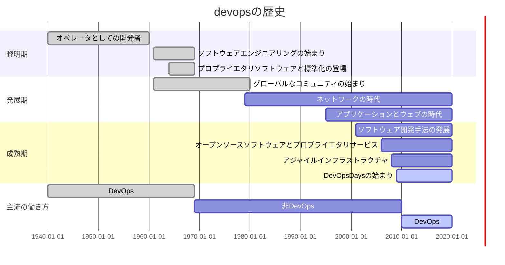

## どんな本？

> devops は、情報のサイロを壊し、関係を観察し、
> チーム間で発生する語会を解消するための反復的な取り組みを強調する
> プロフェッショナルで文化的な運動だ（本書 p.xv）。

こうはいいながらも、本書は、devops の厳格な定義を提供するものではない
---そもそも devops の実践に唯一無二の方法などないからだ。
本書が devops ジャーニーという言葉を用いていることからも（p.xvi）、
組織改革には自分たちで道を探していく覚悟が必要なことがわかる。
本書は、そんな気概をもつ人々のよい指針となるだろう。

効果的な devops の4本柱として、本書は以下のトピックに着目している:

- コラボレーション
- アフィニティ
- ツール
- スケーリング

本書が他の「devops 本」と異なるのは、人間的側面について真っ向から議論しているところ。
対象読者は経営者・管理職・リーダーのようなので、下っ端はさっさと読み終えて、上司に勧めよう。


# 第I部 devops とはなにか

## 第1章 大局を見る
この章は、devopsという言葉の本来の意味を説いている。
devopsが組織を変えるほどの力を持っている秘密は、その文化的・人間的側面にある---特定のツールを指すような薄っぺらい概念ではないのだ。

### 1.1 devops 文化のスナップショット

devopsと言われても、イメージがわかない。
そこで、devops文化が浸透したとある米国企業: Etzyのやり方をみてみよう:
- 新人は、着任してすぐに働き始められる; 支給されるマシンには必須ツールがインストール済みだからだ。
- 道具や方法が標準化されてはいるが、各社員には、それらを使いやすいように調整する自由がある
- 本番環境に影響を与えることなくほぼ同じ環境で仕事ができる（コラム「本番環境って？」を参照）
- 仕事の進捗について、気軽にレビューを依頼できる
- 徹底的につながった知的財産:
  - 仕事は手作業を介さずに提供サービスに反映可能（人的ミスが入り込む余地がない）
  - 障害発生を知らせるシステムがデータベースと連携しているため、自動的に当直だけに電話がかかってくる
- 健全なプロジェクト反省会
- 自分のプロフィール写真のアップロードという簡単な仕事を通じて、初心者にも本番環境を変更する機会を提供している
- 1日に60回もサービスを更新している。ちなみに資源評価は1年に1回。

#### コラム: 本番環境って？
「本番環境」という言葉は、水研職員にとって馴染みがないと思われるので解説する。
本番環境とは、Webサービスを提供中のサーバーのことだ。
Webサービスとは、Amazonを例にとれば、あのサイトで我々ができること全て---商品検索、カートへの追加、購入---を指す。
IT系の大企業がみなWebサービスを持っているのは、これが現時点において、顧客に価値を届けるための最善の方法だからだ。

さて、「本番環境で仕事をする」とはどういうことだろう。
例えば、Amazonのトップページには「こんにちは」という文字列が出るようになっている。
もし、本番環境でこれを「こんばんは」に書き換えれば、このサイトにアクセスする全てのユーザーの画面にただちに影響してしまう。
こんな状況では、危険すぎて仕事を進められない。
そこで開発者には、本番環境とほぼ同じファイル構成の「開発環境」が必要になる。
開発環境で仕事ができれば、開発者は自分だけに閉じた環境でコードを書き換え、変更の結果を手元で確認できる。

仕事が終わると、開発者は成果を「テスト環境に」送る。
他の開発者も並行して仕事をしていることがほとんどなので、全ての変更がうまく噛み合うかを試験するわけだ。
テスト環境でも動作が確認できたら、開発者の仕事は晴れて本番環境に反映される。

### 1.2 文化の発展の経緯
Etzyの仕事のすすめ方は今でこそ模範的だが、はじめは苦労していたようだ:
- 信頼性の低いテスト
- 業務の縦割り（サイロ化）
- 3週間ごとにしかリリースされない製品（それでも資源評価よりはこまめだ）

Etzyはどうやって生まれ変わったのか？
彼らの改革は、鬱憤がたまった社員たち、つまり現場主導で始まったようだ（これは我々と似ている）。
しかし改革には資金が必要なので、彼らは CEO と CTO に相談したようだ（ちゃんと上層部の支持を得ているところを我々も見習うべき）。

改革の発端は、それまで縦割りの壁を挟んで働いていた部署を結ぶことから始まった。
運用エンジニアが開発エンジニアと手を結び、社内向けのデプロイツールを開発した。
これによって、社員たちが抱くデプロイのイメージが変わった---月に一度の嫌なものではなく、ユーザーに価値を届ける手段となったのだ。

これらの改革のカギは、ツールではない。
まず改善の必要性に気づいた人たちがいて、彼らに時間と資金が与えられたことだ。
Etzyでは、どんなレベルでもこの文化を維持することが重視されている
（「どんなレベルでも」: 水研でいえば、チーム、グループ、部、所、機構、というレベルだろう。すばらしい）。

devops とは、以下のような事項に影響を与える文化的改革を大切にする組織だ（ここでの devops の使われ方はおもしろい）:
- 個人が仕事をどのように考えるか
- さまざまな職務をどのように尊重するか
- ビジネス価値をどのように高めるか
- 改革の効果をどのように計測するか


### 1.3 ストーリーの価値
本書は、ただ理屈をこねるだけの本ではない。
実際のケーススタディを失敗事例まで含めて紹介するものだ。
著者たちのケースもあいさつ代わりに紹介されている。
ちょっと見てみよう。

### 1.4 リンのストーリー
第1著者リンは、devops という概念が産まれたころにちょうどキャリアをスタートさせた。
彼女はもともと devops 的価値観を持ったタイプだったが、入社したスタートアップは残念ながら旧態依然な体質だったようだ。
彼女は組織をよりよくしようと努力したが、周りとうまく噛み合わなかった。
New York で開催された devops カンファレンスでの人脈をきっかけに、彼女は Etsy へ転職した。
彼女が本書の執筆を思い立った理由:
- キャリアを変えてくれたコミュニティへの恩返しのため
- 組織の単一障害点としてのプレッシャーを感じている人を救うため

### 1.5 ジェニファーのストーリー
第2著者ジェニファーのストーリーからは、スーパーマンによって回っている組織の弱さを学ぶことができる。
失敗は、システムの弱さを見つける貴重なきっかけだ。
組織は、失敗から学ばなければならない。
失敗しないように細心の注意を払うのでは、まだまだ甘い。
どんどん失敗することでシステムに揺さぶりをかけ、そもそも失敗が起こり得ないように育て上げないといけないのだ---組織みんなで。
すべては人間関係から始まる。

### 1.6 devops をストーリーで説明する
本書にはたくさんのストーリーが載っているが、これらをただ猿真似しても効果は出ない。
コンテクストも冷静に見つめ、そして読むだけでなく、実際に試してみるといい。
ただし、必ず効果を計測し、うまくいったかどうかを評価して、そこから学びを引き出すこと。

## 第２章 devopsとは何か

> "devops"は文化運動だ。（p.13）
> "devopsは思考の方法であり、仕事の方法でもある" (p.13)


### 2.1 文化のための処方箋

- devopsはそれ自体が利益となるものではなく、物事を改善するための処方箋（改善策？）
- devopsは文化運動
  - 価値観
  - 基準
  - 信念
  - 作為
- devopsとは効率的に仕事をするために、社会構造、文化、技術を革新する方法を見つけること。

```
【水研の場合】

社会構造の革新：サイロ化の解消とオンプレミスからの脱却
文化の革新：資源評価報告書文化からmdによる簡潔な報告書へ、そしてTidyデータによるデータハンドリング
技術の革新：ExcelWordからRとプレーンテキストへ
```

### 2.2 devopsの方程式

```
"自分のことを新しいと思っている運動には、古くないすべてのものを支持しようとする危険性がある
 (リー・ロイ・ビーチ他「Natuiralistic Decision Making and Related Research Lines」) (p.13)"
```

- 本書は「唯一無二の正しい方法」を示すものではない
- 誤解やアンチパターンも大事だが、成功例がどのように機能したかが重要
- devopsは開発(dev)と運用（Ops)のみならず組織全体に応用すべき
  - 思考を開発と運用チームのみに限定してはいけない。そのような運動はdevopsではないし、むしろ **害** を与える

```
【水研の場合】

「devopsは新しく革新的な文化だから良いものだ！」と言っているよあの人たち・・・

と思われないことが大事。新しいものが良いわけでない。良さを相手の視線に合わせて伝える必要がある。
```

### 2.2.1 通俗モデルとしてのdevops

```
【通俗】

世間一般の人々にわかりやすく親しみやすいこと。一般向きであること。また、そのさま。
（小学館 デジタル大辞林）
```

- devopsという言葉は普及したが、そのぶん不用意に使われるようにもなった
- なんとなく雰囲気としてわかる
- しかしdevopsは抽象的な考え
  - 定義は人によってさまざま
- devopsを定義するより、**devopsがもたらす効能** について語るべきであろう
  - どんなに良いものであっても、それが可視化できないと人はついてこない

### 2.2.2 古い見方と新しい見方

会社には古い見方と新しい見方がある

- 古い見方(非難文化)
  - ヒューマンエラーは属人問題
  - 腐ったリンゴが問題を犯す
  - ミスを犯す問題or人を除去・修正することで対応

- 新しい見方(devops文化)
  - ヒューマンエラーは構造問題
  - システムに問題があるから人はエラーを犯す
  - 合理的に問題を把握し修正することで対応

新しい文化ではすべてのことが **学習機会** となる。
- チーム内の透明性向上、信頼向上
- ダメージコントロールと防止
- 新しい問題解決に取り組める。イノベーション促進

```
【個人見解】
ヒューマンエラーをさせてしまう環境自体が問題であろう。
ヒューマンエラーは、機能問題以外の問題を炙り出す。
再度にわたるH.エラーは、根本的なシステムやアプローチの問題を炙り出す。
大きな前進へのきっかけとなる。

ケアレスミスに注意せよ、とよく言われる。
ケアレスミスが起こり得ないような仕組みを作ることで、各人に心理的・時間的余裕が生まれる。
```
### 2.2.3 devops共同体
- Devopsは共同体として仕事をすすめる。
  - 信頼関係が必要
  - 非難の応酬を用いてはならない。

---

#### ロッククライマーの例

ロッククライミングは登る人（クライマー）と、落下しないようハーネスを確保する人（ビレイヤー）の共同体で進められる。

##### 手順
1. クライマーの保持の申請
1. ビレイヤーの保持の確保と伝達
1. クライマーの登攀許可の申請
1. ビレイヤーの許可

登攀するという目的が共有されており、そのためのルートは柔軟に決定され、修正される。そして、進行役と許可役の２つの立場による密なコミュニケーションのサイクルが信頼を生む。

仕事を進めていく側は、現場で物事をみているからこそ進むことが出来る。一方、その仕事を支え、許可を出すものは大局的な視野で物事を見ることが出来る。そして双方がそれぞれの視野からベストなルートを選定することができ、ダイナミックなルート修正も可能となる。

---

#### Sparkle Corpの例

Sparkle社のある部署ではベテラン社員（大佐）と新人（ジョージ）が共同で仕事をしている。ここでは、「エンドユーザーのための利益となるサイトの機能実装」が共通認識の目標として存在している。

大佐はジョージに仕事を投げるが、お互いの仕事はサイロ化していない。大佐は価値やプロセス、信念などをジョージに伝える。ジョージは助けやわからない点について大佐にそれを伝える。両者は仕事の進捗について報告しあいながら進むことができ、明確なコミュニケーションによって安心と信頼を維持する。


明確な意思疎通によって技術的・心理的・構造的な問題を削減することが出来る。


```
【個人見解】

devops共同体には以下の要素が重要だろうと考えてみた。
- 明確に定義された目標の共有(DOC?)
- その場その場でのコミュニケーション
- 理解をダイナミックに調整・修正。直すこと、削除する勇気

【水研の場合】

明確に定義された目標の共有：水産資源の利用と保全
その場でのコミュニケーション：サイロ化
理解をダイナミックに調整・修正：伝統的な.xlsを引き継ぐウナギのタレ方式
```

> 誰かがその機能を担当するだろうとか、そのうち終わるだろうといった考えは改める。そしてソフトウェアの本来の動作を妨げているバグを修正する。本番環境でものごとが期待どおりに進まないときは、プロセスを直しドキュメントにも反映する。(p.16)

本章のdevops共同体の考えは本書全体で一貫している。このような文化的側面が技術的側面と合わさり、共通の相互理解を構築する。明確に、恐れずに、目的を共有しながらコミュニケーションをとることの大事さを胸に刻むべきであろう。

## 第３章 devopsの歴史
**要約**
 - 黎明期、開発と運用が未分化だったためDevOps的な働き方であった。
 - 発展期、企業の利益のために (社内であっても) 知識の共有が迷惑がられ、DevOpsは一度失われた。
 - 成熟期の現在、DevOpsの働き方が再び注目されている。
 - devopsの導入によってソフトウェア業界は大きく変わった。  
   **––専門化を競い合うことから職種を超えた互いの協力と協調の重視へと––**

### 3.1 - 3.10
以下のガントチャートに集約される。(細かい話が気になるなら本書を読め！！ 笑)




### 3.11 devopsの現状
 - 2009年当時1つだったDevOpsDaysカンファレンスは2015年時点で22に増加。
 - 2020年現在では33。[DevOpsDaysカンファレンス](https://devopsdays.org)

### 3.12 まとめ
 - 歴史を振り返ると、人とプロセスではなく、結果を重視する傾向が見える。
 - DevOps導入による特定の成果 (1日10回以上デプロイできるようになった!など) を強調しすぎると、  
   すでに組織の限界にストレスを感じている人たちにさらにストレスを与えてしまう。  
 - 機械的なプロセスとは違い、ソフトウェアは人的要因に依存する部分が多いことを理解しよう。
 - 文化とプロセスを重視すると、反復が尊ばれ、「なぜ・どのように仕事をするか」を改善することが重視されるようになる。
 - 私たちの重点が「何」から「なぜ」に移ると、私たちの仕事が持つ意味と目的を確立する自由と信頼が与えられる。

## 第4章 基本的な用語と概念

この章ではソフトウェア開発と運用における基本的な用語について説明する。ソフトウェア工学には様々な手法が存在しているが、開発プロセスにとって良い手法を選択し、運用にもその手法を適用することが必ずしも正しいわけではない。様々な手法を知り、その中で一番効果的な手法・方法を知ることがdevopsの重要な部分なのだ。

### 4.1 ソフトウェア開発手法

開発の仕事を別々のフェーズに分割することを **ソフトウェア開発手法** と呼ぶ。ソフトウェア開発手法は大きく分けて、
- アーティファクト（成果物）の仕様作成
- 開発とコードが仕様に従っていることの確認
- エンドユーザーや本番環境へのコードのデプロイ

の３つに分類される。すなわち、目的設定、設計と確認、そして発表と運用のようなものだ。

以下では代表的な開発手法について紹介する。

#### 4.1.1 ウォーターフォール
滝の流れの様に、仕事のステージが終わったら、次のステージが開始するという開発手法。水研の資源評価などはこれにあたる。

要求 <br>
⬇ <br>
設計 <br>
⬇ <br>
実装 <br>
⬇ <br>
テスト <br>
⬇ <br>
保守

途中からの仕様変更が難い場合は時間を掛けて要求仕様をしっかり定義し、設計を正しく行うことで初めからミスを減らすという方法をとる。ミスを修正できる環境よりもそもそもミスをしない方法（そして修正するときは大変）に重きを置いた開発手法である。

#### 4.1.2 アジャイル
アジャイルはウォーターフォールなどの従来手法と比べて軽量かつ柔軟な一連の手法だ。その真理は2001年のアジャイルソフトウェア開発宣言（以下）でまとめられている。

> 私たちは、ソフトウェア開発の実践あるいは実践を手助けする活動を通じて、よりよい開発手法を見つけ出そうとしている。この活動を通して、私たちは以下の価値に至った。
>
> プロセスやツールよりも個人と対話を、 <br>
包括的なドキュメントよりも動くソフトウェアを、 <br>
契約交渉よりも顧客との協調を、 <br>
計画に従うよりも変化への対応を、
>
>価値とする。すなわち左記のことがらに価値があることを認めながらも私たちは右記のことがらにより価値をおく。 (p.31)


長いスパンで仕事をしていて、いざ完成したときに、初期のミスが発覚して芋づる式にミスの影響が伝播し大きな問題となった経験はないだろうか？初期の段階でミスチェックその都度行っていれば、大きな影響が出る前に修正することが出来る。アジャイル開発は大きな単位で開発を区切るのではなく、こまめに設計と実装、テスト、保守などの一連のプロセスを経ることで、ミスを低減し、リスクを減らそうとする働き方なのだ。

#### 4.1.3 スクラム

スクラムは、固定した短期間で仕事のサイクルを回す手法である。サイクルはスプリントと呼ばれ、１～４週間程度であり、その都度達成すべき目標や顧客のニーズ、問題点、ミスの確認などを行う。この手法では開発チームが変化 — プロジェクトの変化と顧客ニーズの変化 — にすばやく対応する能力を最大化することに重点を置いている。

【スクラムの例】

スプリントプランニング（スプリントで何を達成目標とするか）<br>
↓ <br>
開発（固定期間）<br>
↓ <br>
スプリントレビュー（成果と目標達成の確認）<br>
↓ <br>
スプリントレトロスペクティブ（スプリントの振り返りと問題点の議論）<br>
↓ <br>
次のスプリント<br>

スプリント内では、デイリースクラムと呼ばれるミーティングがあり、
- 昨日やること
- 今日やること
- 問題点

について共有することで、問題点を一人で抱え込まさせずに、チームでの解決を促進させる。

各ミーティングの進行役を務めるのがスクラムマスターと呼ばれるポジションだ。
スクラムマスターの主な役割は次の通り：

- チームの自己組織化の支援
- 仕事の調整補助
- チームの前進の促進
- 顧客やステークホルダーを巻き込んで達成目標を確認
- 意思の疎通をとる

##### コラム：水研で開発？
「開発手法」という言葉は水研の業務とは関係ないように聞こえる。
開発というのは「新商品を開発する」ことではなく、顧客（水産庁だったり漁業者だったり）のニーズにこたえた仕事を行い、それを彼らに渡すことである。すなわち、資源評価の場合は水産庁（顧客）に対して新しいデータを用いた資源評価結果という製品を納入することと同義である。

本章ではソフトウェア開発手法について語られているため、ソフトウェアを開発していない水研業務には関係ないように聞こえるかもしれない。

しかし、本質的にはアイデアや知識をエクセルに落とし込んで計算し、その結果を（手で）出力するという手順はソフトウェアと大差ない。コンピューターが計算結果を次の計算式に代入するか、担当者がコピー＆ペーストで別エクセルシートに代入するかの違いでしかないのだ。

### 4.2 運用手法
#### 4.2.1 ITIL
#### 4.2.2 COBIT
### 4.3 システム手法
#### 4.3.1 リーン
### 4.4 開発、リリース、デプロイの諸概念
#### 4.4.1 バージョン管理
#### 4.4.2 テスト駆動開発
#### 4.4.3 アプリケーションのデプロイ
#### 4.4.4 継続的インテグレーション
#### 4.4.5 継続的デリバリー
#### 4.4.6 継続的デプロイ
#### 4.4.7 MVP(実用最小限の製品)
### 4.5 インフラストラクチャーに関する概念
#### 4.5.1 構成管理
#### 4.5.2 クラウドコンピューティング
#### 4.5.3 インフラストラクチャー自動化
#### 4.5.4 アーティファクト管理
#### 4.5.5 コンテナ
### 4.6 文化的な概念
#### 4.6.1 レトロスペクティブ
#### 4.6.2 ポストモーテム
#### 4.6.3 非難のない文化
#### 4.6.4 組織的な学習
### 4.7 まとめ


# 第II部 コラボレーション

# 第III部 アフィニティ

# 第IV部 ツール

# 第V部 スケーリング

# 第VI部 devops 文化への架け橋

---
## 抜粋

> ... devops にはほんとうの意味での終わりはない。継続的で反復的なプロセスである---p.325

> 切り花のブーケを買ってきてもガーデニングにはならないように、
> 単純に「devopsソリューション」と称するツールを買ってきても devops にはならない---p.325


## 書籍情報

```bib
@book{davis2018-effective-devops,
  title      = {Effective DevOps---4本柱による持続可能な組織文化の育て方},
  author     = {Davis, Jennifer and Daniels, Ryn},
  translator = {吉羽, 龍太郎 and 長尾, 高弘},
  supervisor = {吉羽, 龍太郎},
  year       = 2018,
  language   = {Japanese},
  publisher  = {オライリー・ジャパン},
  location   = {Tokyo},
  url        = {https://www.oreilly.co.jp/books/9784873118352/},
  isbn       = {9784873118352},
}
```

## 輪読参加者

- [@akimanabe](https://github.com/akimanabe)
- [@JK-junkin](https://github.com/JK-junkin)
- [@Rindrics](https://github.com/Rindrics)
