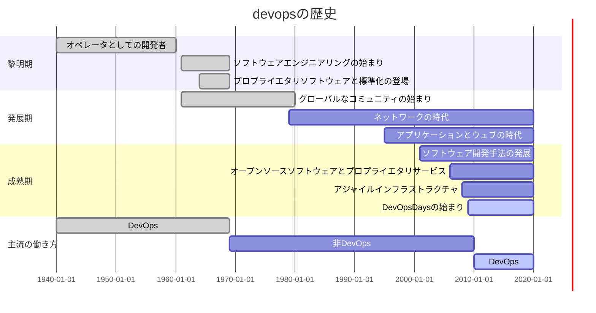

# 第3章 devopsの歴史
**要約**
 - 黎明期、開発と運用が未分化だったためDevOps的な働き方であった。
 - 発展期、企業の利益のために (社内であっても) 知識の共有が迷惑がられ、DevOpsは一度失われた。
 - 成熟期の現在、DevOpsの働き方が再び注目されている。
 - devopsの導入によってソフトウェア業界は大きく変わった。  
   **––専門化を競い合うことから職種を超えた互いの協力と協調の重視へと––**

## 3.1 - 3.10
以下のガントチャートに集約される。(細かい話が気になるなら本書を読め！！ 笑)

## 3.11 devopsの現状
 - 2009年当時1つだったDevOpsDaysカンファレンスは2015年時点で22に増加。
 - 2020年現在では33。[DevOpsDaysカンファレンス](https://devopsdays.org)

## 3.12 まとめ
 - 歴史を振り返ると、人とプロセスではなく、結果を重視する傾向が見える。
 - DevOps導入による特定の成果 (1日10回以上デプロイできるようになった!など) を強調しすぎると、  
   すでに組織の限界にストレスを感じている人たちにさらにストレスを与えてしまう。  
 - 機械的なプロセスとは違い、ソフトウェアは人的要因に依存する部分が多いことを理解しよう。
 - 文化とプロセスを重視すると、反復が尊ばれ、「なぜ・どのように仕事をするか」を改善することが重視されるようになる。
 - 私たちの重点が「何」から「なぜ」に移ると、私たちの仕事が持つ意味と目的を確立する自由と信頼が与えられる。
