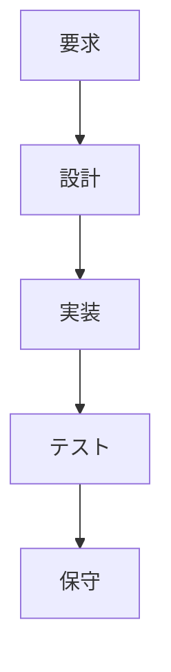
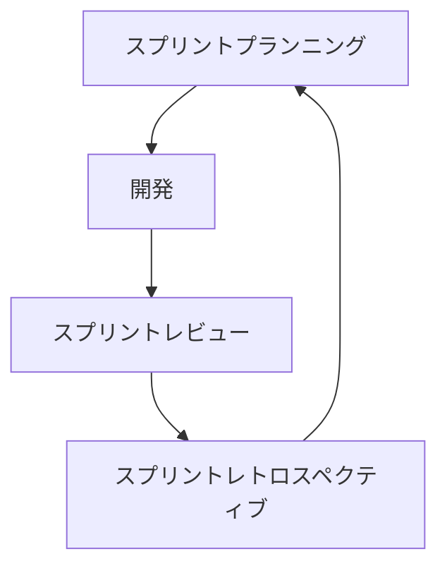

# 第4章 基本的な用語と概念

この章ではソフトウェア開発と運用における基本的な用語について説明する。ソフトウェア工学には様々な手法が存在しているが、開発プロセスにとって良い手法を選択し、運用にもその手法を適用することが必ずしも正しいわけではない。様々な手法を知り、その中で一番効果的な手法・方法を知ることがdevopsの重要な部分なのだ。

## 4.1 ソフトウェア開発手法

開発の仕事を別々のフェーズに分割することを **ソフトウェア開発手法** と呼ぶ。ソフトウェア開発手法は大きく分けて、
- アーティファクト（成果物）の仕様作成
- 開発とコードが仕様に従っていることの確認
- エンドユーザーや本番環境へのコードのデプロイ

の３つに分類される。すなわち、目的設定、設計と確認、そして発表と運用のようなものだ。

以下では代表的な開発手法について紹介する。

### 4.1.1 ウォーターフォール
滝の流れの様に、仕事のステージが終わったら、次のステージが開始するという開発手法。水研の資源評価などはこれにあたる。

途中からの仕様変更が難い場合は時間を掛けて要求仕様をしっかり定義し、設計を正しく行うことで初めからミスを減らすという方法をとる。ミスを修正できる環境よりもそもそもミスをしない方法（そして修正するときは大変）に重きを置いた開発手法である。

### 4.1.2 アジャイル
アジャイルはウォーターフォールなどの従来手法と比べて軽量かつ柔軟な一連の手法だ。その真理は2001年のアジャイルソフトウェア開発宣言（以下）でまとめられている。

> 私たちは、ソフトウェア開発の実践あるいは実践を手助けする活動を通じて、よりよい開発手法を見つけ出そうとしている。この活動を通して、私たちは以下の価値に至った。
>
> プロセスやツールよりも個人と対話を、  
包括的なドキュメントよりも動くソフトウェアを、  
契約交渉よりも顧客との協調を、  
計画に従うよりも変化への対応を、
>
>価値とする。すなわち左記のことがらに価値があることを認めながらも私たちは右記のことがらにより価値をおく。 (p.31)

長いスパンで仕事をしていて、いざ完成したときに、初期のミスが発覚して芋づる式にミスの影響が伝播し大きな問題となった経験はないだろうか？初期の段階でミスチェックその都度行っていれば、大きな影響が出る前に修正することが出来る。アジャイル開発は大きな単位で開発を区切るのではなく、こまめに設計と実装、テスト、保守などの一連のプロセスを経ることで、ミスを低減し、リスクを減らそうとする働き方なのだ。

### 4.1.3 スクラム

スクラムは、固定した短期間で仕事のサイクルを回す手法である。サイクルはスプリントと呼ばれ、１～４週間程度であり、その都度達成すべき目標や顧客のニーズ、問題点、ミスの確認などを行う。この手法では開発チームが変化 — プロジェクトの変化と顧客ニーズの変化 — にすばやく対応する能力を最大化することに重点を置いている。

【スクラムの例】

スプリントプランニングではスプリントの目標を定義し、固定した開発期間を決定する。スプリント期間終了時には、目標達成度を確認するスプリントレビューを行い、レトロスペクティブを行う。

スプリント内では、デイリースクラムと呼ばれるミーティングがあり、
- 昨日やること
- 今日やること
- 問題点

について共有することで、問題点を一人で抱え込まさせずに、チームでの解決を促進させる。

各ミーティングの進行役を務めるのがスクラムマスターと呼ばれるポジションだ。
スクラムマスターの主な役割は次の通り：

- チームの自己組織化の支援
- 仕事の調整補助
- チームの前進の促進
- 顧客やステークホルダーを巻き込んで達成目標を確認
- 意思の疎通をとる

#### コラム：水研で開発？
「開発手法」という言葉は水研の業務とは関係ないように聞こえる。
開発というのは「新商品を開発する」ことではなく、顧客（水産庁だったり漁業者だったり）のニーズにこたえた仕事を行い、それを彼らに渡すことである。すなわち、資源評価の場合は水産庁（顧客）に対して新しいデータを用いた資源評価結果という製品を納入することと同義である。

本章ではソフトウェア開発手法について語られているため、ソフトウェアを開発していない水研業務には関係ないように聞こえるかもしれない。

しかし、本質的にはアイデアや知識をエクセルに落とし込んで計算し、その結果を（手で）出力するという手順はソフトウェアと大差ない。コンピューターが計算結果を次の計算式に代入するか、担当者がコピー＆ペーストで別エクセルシートに代入するかの違いでしかないのだ。

## 4.2 運用手法

ソフトウェア開発ではプロセスごとがフェーズに分解されていた（開発・テスト・デプロイなど）。運用も同じく分割することができる。分割・構造化の方法についてはITILやCOBITのようなベストプラクティス集が出版され、デファクトスタンダードとなっている。しかしベストプラクティスだからといって鵜呑みにするのではなく、自らの環境に応じたカスタマイズが必要である。

 - **ITIL**: ITサービス管理のベストプラクティス集

 - **COBIT**: ITガバナンスの成熟度を測るフレームワーク

## 4.3 システム手法

システム思考はソフトウェア開発や運用のみならず全体を扱うものである。代表的な手法である **リーン生産** は以下の原則によって定義される。

### リーン思考の5原則
- **価値** (必要なことを必要な時に、効率よく、安全かつ正確に達成すること)
- **バリューストリーム** (開発の流れを明確にしてムダを改善する方法)
- **フロー** (停滞を最小にして価値を速やかに顧客に届ける方法)
- **プル** (顧客によってトリガーされ価値の提供を始めること)
- **完全性** (改善の余地がない状態を追求すること)

リーンでは、これらの思想と共にムダを取り除くことに全力を注ぐ手法である。

### リーン生産手法で定義されるムダ
- 仕掛りの仕事
- 余分な機能
- 学習のやり直し
- 不要な引継ぎ
- タスクスイッチ
- 遅れと欠陥

リーンとは「痩せた」を意味する言葉。効果的に価値を生み出すためには、プロセスから全ての無駄を取り除く必要がある。

## 4.4 開発、リリース、デプロイの諸概念

devops文化はソフトウェア開発手法以外にも様々な要素によって支えられている。以下に代表的なものをまとめる。

| 要素 | 説明 |
|-----|-----|
| バージョン管理(VCS) | ファイルの変更履歴を管理するシステム。過去のCommit(変更)を復元できるため、複数人での開発時にも情報喪失のリスクを低減できる。 |
| テスト駆動開発(TDD) | まず失敗するテストを書くことからはじめる開発手法。機能を明確に定義してから開発を始めるため、プログラムのバグが少なくなる。
| アプリケーションのデプロイ | ソフトウェアを本番環境に配置展開して実用に供するプロセス。|
| 継続的インテグレーション(CI) |作業結果を頻繁にマスターに統合することで大きなエラーやコンフリクトを予防する手法。また、コミットやマージにあたり自動テストを行うことで、問題の即時修正を可能にする。 |
| 継続的デリバリー(CD) | 自動テストとCIを統合することで、ソフトウェアをデプロイ可能な状態に保つ手法。|
| 継続的デプロイ(CD) | 継続的デリバリーから一歩すすめて、変更を実際に本番環境にデプロイする手法。 |
| MVP(実用最小限の製品) | 必要最小限の労力で製品のプロトタイプを作るというプロセス。最小限の投資で顧客に関する情報を収集することでコストとムダを削減する手法。|

## 4.5 インフラストラクチャーに関する概念

仕事の多くは何かしらのインフラストラクチャーの上で実行される。自前のコンピューターやクラウド環境がそれにあたる。開発と運用が連続的になるdevopsでは、インフラストラクチャーの理解は重要となる。

### 4.5.1 構成管理
- 製品のライフサイクルを、識別、管理、監視、監査するプロセス
- 一貫した環境や要素を構築することでパフォーマンスを確立させる。
- 例：Chef, Ansibleなど

### 4.5.2 クラウドコンピューティング
- インターネットを経由してコンピューター機能や処理能力をサービスとして提供する
- 柔軟かつ利便性があり、統一した環境での作業を行うことが可能
- devopsの文化と親和性が高い
  - 自分にとって効果的なものを用いて開発するdevopsにとってクラウドコンピューティングは **必須ではない** 。
- 例：AmazonAWS lambda, Microsoft Azureなど

### 4.5.3 インフラストラクチャー自動化
- システムの保守や管理を自動化させることで失敗と労力を削減する手法。
- 反復的な手作業の混乱とエラーを取り除き効率的な運用が可能。
- 例：TraivisCI, CircleCI

### 4.5.4 アーティファクト管理
- ソフトウェア開発プロセスでの生成されたバイナリやパッケージをレポジトリ等で管理する手法
- 例：AWS CodeArtifact

### 4.5.5 コンテナ
- 仮想環境で開発やデプロイを行うことができる技術である。
- コンテナ技術によってOSやハードウェアへの依存度を下げ、本番環境を意識した開発が可能となる。
- 例：Docker, Kubernates

## 4.6 文化的な概念

アジャイル開発など人の協力関係について言及されているが、それ以外にもコミュニケーション文化として重要なものが挙げられる。目標の共有や頻繁なデプロイ、ムダの削減のためにはコミュニケーションが重要となる。

### 4.6.1 レトロスペクティブ

レトロスペクティブはプロジェクト終了後（あるいは定期的）に行われる議論で、以下の事などが議論、共有される。
- 何が起きたか
- うまくいったことは何か
- 失敗したことは何か
- 将来改善すべきこと

#### 水研とレトロスペクティブ

水研には、レトロスペクティブの文化がない。能力の高い研究者が多い職場であるため、ミスを事前に修正しているケースが多いからだ。しかしこれでは、システムの欠陥が能力の高い働き手によって隠されたままになってしまう。失敗をどんどん見えるようにし、レトロスペクティブによって知識を共有すれば、プロジェクトチーム全体として失敗から学ぶことが可能となる。

### 4.6.2 ポストモーテム

ポストモーテムはシステムや組織の欠陥によって想定外のインシデントや障害が起きた後に行われる事後検証である。ポストモーテムでは教訓を全社規模で学習させる手法であり、以下の事などを体系的に議論することで効果を増大させる。
- 何が起きたのか
- 報告
- 改善事項

ポストモーテムを非難の場にしてはならない。インシデントの責任を押し付けることは、学習として効果的とは言えないからだ。

### 4.6.3 非難のない文化

非難のない文化はインシデントを学習の場としてとらえることに重点を置いた方が効果的であるという概念である。非難のない文化は人を無責任な環境に放り出すのではなく、インシデントや問題を明らかにすることを円滑にするために、当事者を安心させるためでもある。詳細な解明を通すことで教訓の学習が可能となる。

### 4.6.4 組織的な学習

> 組織的な学習とは知識が持つ知恵を集め、成長させ、共有するプロセスである。
> 学習する組織とは、学習を意識的に行い、学習を具体的な目標として掲げ、時間とともに蓄積された学終了を増やしていくために具体的な活動をしている組織の事だ。(p.41)

組織的な学習は非難のない文化をつくり、生じた問題から経験や教訓を導き出すことが出来る。

#### FDOB活動と組織的な学習

fra-dev-ops-buも組織的な学習を実践している。1人で学習するより3人で学習することで相乗効果が生まれ、互いに前進する切っ掛けを与えてくれる。組織的な学習は個人的な学習を促進し、学習はより自らの視点をより高い視点へ移すことが可能になる。水研として生態学や水産資源学の勉強会は行われているが、より高い視点の勉強会も今後は頻繁に行われるべきである。

## 4.7 まとめ
本章ではdevopsを取り巻く様々な要素を紹介した。開発、デプロイ、運用、学習についての土台となる考え方は重要である。しかし、ソフトウェアの開発手法やコミュニケーションの取り方、運用の手法や環境の構築などの手法は今後も進化していくのであろう。
