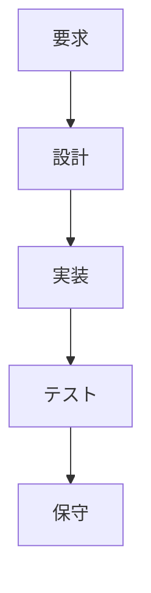
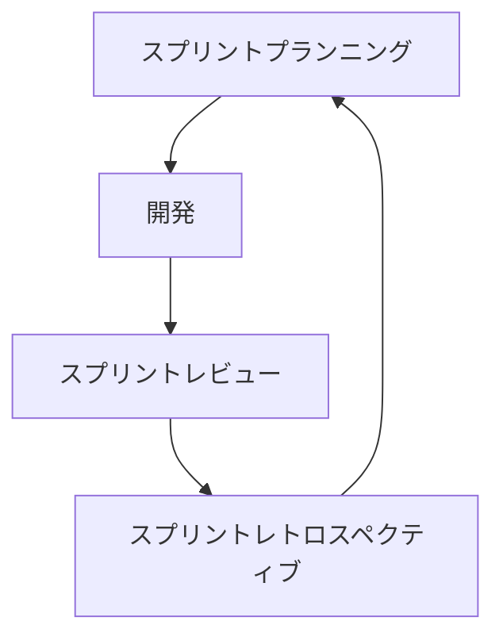

## どんな本？

> devops は、情報のサイロを壊し、関係を観察し、
> チーム間で発生する語会を解消するための反復的な取り組みを強調する
> プロフェッショナルで文化的な運動だ（本書 p.xv）。

こうはいいながらも、本書は、devops の厳格な定義を提供するものではない
---そもそも devops の実践に唯一無二の方法などないからだ。
本書が devops ジャーニーという言葉を用いていることからも（p.xvi）、
組織改革には自分たちで道を探していく覚悟が必要なことがわかる。
本書は、そんな気概をもつ人々のよい指針となるだろう。

効果的な devops の4本柱として、本書は以下のトピックに着目している:

- コラボレーション
- アフィニティ
- ツール
- スケーリング

本書が他の「devops 本」と異なるのは、人間的側面について真っ向から議論しているところ。
対象読者は経営者・管理職・リーダーのようなので、下っ端はさっさと読み終えて、上司に勧めよう。


# 第I部 devops とはなにか

## [第1章 大局を見る](chap1.md)

## [第2章 devopsとは何か](chap2.md)

## [第3章 devopsの歴史](chap3.md)

## 第4章 基本的な用語と概念

この章ではソフトウェア開発と運用における基本的な用語について説明する。ソフトウェア工学には様々な手法が存在しているが、開発プロセスにとって良い手法を選択し、運用にもその手法を適用することが必ずしも正しいわけではない。様々な手法を知り、その中で一番効果的な手法・方法を知ることがdevopsの重要な部分なのだ。

### 4.1 ソフトウェア開発手法

開発の仕事を別々のフェーズに分割することを **ソフトウェア開発手法** と呼ぶ。ソフトウェア開発手法は大きく分けて、
- アーティファクト（成果物）の仕様作成
- 開発とコードが仕様に従っていることの確認
- エンドユーザーや本番環境へのコードのデプロイ

の３つに分類される。すなわち、目的設定、設計と確認、そして発表と運用のようなものだ。

以下では代表的な開発手法について紹介する。

#### 4.1.1 ウォーターフォール
滝の流れの様に、仕事のステージが終わったら、次のステージが開始するという開発手法。水研の資源評価などはこれにあたる。



途中からの仕様変更が難い場合は時間を掛けて要求仕様をしっかり定義し、設計を正しく行うことで初めからミスを減らすという方法をとる。ミスを修正できる環境よりもそもそもミスをしない方法（そして修正するときは大変）に重きを置いた開発手法である。

#### 4.1.2 アジャイル
アジャイルはウォーターフォールなどの従来手法と比べて軽量かつ柔軟な一連の手法だ。その真理は2001年のアジャイルソフトウェア開発宣言（以下）でまとめられている。

> 私たちは、ソフトウェア開発の実践あるいは実践を手助けする活動を通じて、よりよい開発手法を見つけ出そうとしている。この活動を通して、私たちは以下の価値に至った。
>
> プロセスやツールよりも個人と対話を、 <br>
包括的なドキュメントよりも動くソフトウェアを、 <br>
契約交渉よりも顧客との協調を、 <br>
計画に従うよりも変化への対応を、
>
>価値とする。すなわち左記のことがらに価値があることを認めながらも私たちは右記のことがらにより価値をおく。 (p.31)


長いスパンで仕事をしていて、いざ完成したときに、初期のミスが発覚して芋づる式にミスの影響が伝播し大きな問題となった経験はないだろうか？初期の段階でミスチェックその都度行っていれば、大きな影響が出る前に修正することが出来る。アジャイル開発は大きな単位で開発を区切るのではなく、こまめに設計と実装、テスト、保守などの一連のプロセスを経ることで、ミスを低減し、リスクを減らそうとする働き方なのだ。

#### 4.1.3 スクラム

スクラムは、固定した短期間で仕事のサイクルを回す手法である。サイクルはスプリントと呼ばれ、１～４週間程度であり、その都度達成すべき目標や顧客のニーズ、問題点、ミスの確認などを行う。この手法では開発チームが変化 — プロジェクトの変化と顧客ニーズの変化 — にすばやく対応する能力を最大化することに重点を置いている。

【スクラムの例】



スプリントプランニングではスプリントの目標を定義し、固定した開発期間を決定する。スプリント期間終了時には、目標達成度を確認するスプリントレビューを行い、レトロスペクティブを行う。

スプリント内では、デイリースクラムと呼ばれるミーティングがあり、
- 昨日やること
- 今日やること
- 問題点

について共有することで、問題点を一人で抱え込まさせずに、チームでの解決を促進させる。

各ミーティングの進行役を務めるのがスクラムマスターと呼ばれるポジションだ。
スクラムマスターの主な役割は次の通り：

- チームの自己組織化の支援
- 仕事の調整補助
- チームの前進の促進
- 顧客やステークホルダーを巻き込んで達成目標を確認
- 意思の疎通をとる

##### コラム：水研で開発？
「開発手法」という言葉は水研の業務とは関係ないように聞こえる。
開発というのは「新商品を開発する」ことではなく、顧客（水産庁だったり漁業者だったり）のニーズにこたえた仕事を行い、それを彼らに渡すことである。すなわち、資源評価の場合は水産庁（顧客）に対して新しいデータを用いた資源評価結果という製品を納入することと同義である。

本章ではソフトウェア開発手法について語られているため、ソフトウェアを開発していない水研業務には関係ないように聞こえるかもしれない。

しかし、本質的にはアイデアや知識をエクセルに落とし込んで計算し、その結果を（手で）出力するという手順はソフトウェアと大差ない。コンピューターが計算結果を次の計算式に代入するか、担当者がコピー＆ペーストで別エクセルシートに代入するかの違いでしかないのだ。

### 4.2 運用手法

ソフトウェア開発ではプロセスごとがフェーズに分解されていた（開発・テスト・デプロイなど）。運用も同じく分割することができる。分割・構造化の方法についてはITILやCOBITのようなベストプラクティス集が出版され、デファクトスタンダードとなっている。しかしベストプラクティスだからといって鵜呑みにするのではなく、自らの環境に応じたカスタマイズが必要である。

 - **ITIL**: ITサービス管理のベストプラクティス集

 - **COBIT**: ITガバナンスの成熟度を測るフレームワーク

### 4.3 システム手法

システム思考はソフトウェア開発や運用のみならず全体を扱うものである。代表的な手法である **リーン生産** は以下の原則によって定義される。

#### リーン思考の5原則
- **価値** (必要なことを必要な時に、効率よく、安全かつ正確に達成すること)
- **バリューストリーム** (開発の流れを明確にしてムダを改善する方法)
- **フロー** (停滞を最小にして価値を速やかに顧客に届ける方法)
- **プル** (顧客によってトリガーされ価値の提供を始めること)
- **完全性** (改善の余地がない状態を追求すること)

リーンでは、これらの思想と共にムダを取り除くことに全力を注ぐ手法である。

#### リーン生産手法で定義されるムダ
- 仕掛りの仕事
- 余分な機能
- 学習のやり直し
- 不要な引継ぎ
- タスクスイッチ
- 遅れと欠陥

リーンとは「痩せた」を意味する言葉。効果的に価値を生み出すためには、プロセスから全ての無駄を取り除く必要がある。

### 4.4 開発、リリース、デプロイの諸概念

devops文化はソフトウェア開発手法以外にも様々な要素によって支えられている。以下に代表的なものをまとめる。

| 要素 | 説明 |
|-----|-----|
| バージョン管理(VCS) | ファイルの変更履歴を管理するシステム。過去のCommit(変更)を復元できるため、複数人での開発時にも情報喪失のリスクを低減できる。 |
| テスト駆動開発(TDD) | まず失敗するテストを書くことからはじめる開発手法。機能を明確に定義してから開発を始めるため、プログラムのバグが少なくなる。
| アプリケーションのデプロイ | ソフトウェアを本番環境に配置展開して実用に供するプロセス。|
| 継続的インテグレーション(CI) |作業結果を頻繁にマスターに統合することで大きなエラーやコンフリクトを予防する手法。また、コミットやマージにあたり自動テストを行うことで、問題の即時修正を可能にする。 |
| 継続的デリバリー(CD) | 自動テストとCIを統合することで、ソフトウェアをデプロイ可能な状態に保つ手法。|
| 継続的デプロイ(CD) | 継続的デリバリーから一歩すすめて、変更を実際に本番環境にデプロイする手法。 |
| MVP(実用最小限の製品) | 必要最小限の労力で製品のプロトタイプを作るというプロセス。最小限の投資で顧客に関する情報を収集することでコストとムダを削減する手法。|

### 4.5 インフラストラクチャーに関する概念

仕事の多くは何かしらのインフラストラクチャーの上で実行される。自前のコンピューターやクラウド環境がそれにあたる。開発と運用が連続的になるdevopsでは、インフラストラクチャーの理解は重要となる。

#### 4.5.1 構成管理
- 製品のライフサイクルを、識別、管理、監視、監査するプロセス
- 一貫した環境や要素を構築することでパフォーマンスを確立させる。
- 例：Chef, Ansibleなど

#### 4.5.2 クラウドコンピューティング
- インターネットを経由してコンピューター機能や処理能力をサービスとして提供する
- 柔軟かつ利便性があり、統一した環境での作業を行うことが可能
- devopsの文化と親和性が高い
  - 自分にとって効果的なものを用いて開発するdevopsにとってクラウドコンピューティングは **必須ではない** 。
- 例：AmazonAWS lambda, Microsoft Azureなど

#### 4.5.3 インフラストラクチャー自動化
- システムの保守や管理を自動化させることで失敗と労力を削減する手法。
- 反復的な手作業の混乱とエラーを取り除き効率的な運用が可能。
- 例：TraivisCI, CircleCI

#### 4.5.4 アーティファクト管理
- ソフトウェア開発プロセスでの生成されたバイナリやパッケージをレポジトリ等で管理する手法
- 例：AWS CodeArtifact

#### 4.5.5 コンテナ
- 仮想環境で開発やデプロイを行うことができる技術である。
- コンテナ技術によってOSやハードウェアへの依存度を下げ、本番環境を意識した開発が可能となる。
- 例：Docker, Kubernates

### 4.6 文化的な概念

アジャイル開発など人の協力関係について言及されているが、それ以外にもコミュニケーション文化として重要なものが挙げられる。目標の共有や頻繁なデプロイ、ムダの削減のためにはコミュニケーションが重要となる。

#### 4.6.1 レトロスペクティブ

レトロスペクティブはプロジェクト終了後（あるいは定期的）に行われる議論で、以下の事などが議論、共有される。
- 何が起きたか
- うまくいったことは何か
- 失敗したことは何か
- 将来改善すべきこと

##### 水研とレトロスペクティブ

水研には、レトロスペクティブの文化がない。能力の高い研究者が多い職場であるため、ミスを事前に修正しているケースが多いからだ。しかしこれでは、システムの欠陥が能力の高い働き手によって隠されたままになってしまう。失敗をどんどん見えるようにし、レトロスペクティブによって知識を共有すれば、プロジェクトチーム全体として失敗から学ぶことが可能となる。

#### 4.6.2 ポストモーテム

ポストモーテムはシステムや組織の欠陥によって想定外のインシデントや障害が起きた後に行われる事後検証である。ポストモーテムでは教訓を全社規模で学習させる手法であり、以下の事などを体系的に議論することで効果を増大させる。
- 何が起きたのか
- 報告
- 改善事項

ポストモーテムを非難の場にしてはならない。インシデントの責任を押し付けることは、学習として効果的とは言えないからだ。

#### 4.6.3 非難のない文化

非難のない文化はインシデントを学習の場としてとらえることに重点を置いた方が効果的であるという概念である。非難のない文化は人を無責任な環境に放り出すのではなく、インシデントや問題を明らかにすることを円滑にするために、当事者を安心させるためでもある。詳細な解明を通すことで教訓の学習が可能となる。

#### 4.6.4 組織的な学習

> 組織的な学習とは知識が持つ知恵を集め、成長させ、共有するプロセスである。
> 学習する組織とは、学習を意識的に行い、学習を具体的な目標として掲げ、時間とともに蓄積された学終了を増やしていくために具体的な活動をしている組織の事だ。(p.41)

組織的な学習は非難のない文化をつくり、生じた問題から経験や教訓を導き出すことが出来る。

##### FDOB活動と組織的な学習

fra-dev-ops-buも組織的な学習を実践している。1人で学習するより3人で学習することで相乗効果が生まれ、互いに前進する切っ掛けを与えてくれる。組織的な学習は個人的な学習を促進し、学習はより自らの視点をより高い視点へ移すことが可能になる。水研として生態学や水産資源学の勉強会は行われているが、より高い視点の勉強会も今後は頻繁に行われるべきである。

### 4.7 まとめ
本章ではdevopsを取り巻く様々な要素を紹介した。開発、デプロイ、運用、学習についての土台となる考え方は重要である。しかし、ソフトウェアの開発手法やコミュニケーションの取り方、運用の手法や環境の構築などの手法は今後も進化していくのであろう。

## 第5章 devopsに対する誤解とアンチパターン
### 5.1 devopsに対するよくある誤解
この節は、各項（章, 節, 項の項）のタイトルがよくある誤解を表している。一覧してみよう。
（下記の数字リストは、5.1節の項番号に対応している。）

1. ~~devopsに関係があるのは開発者とシステム管理者だけだ~~  
    ==> 否。devops運動が開発者 Development とシステム管理者（運用者 Operations）の部署間ではじまっただけ。この運動の本質はすべての部署に適用できる。
2. ~~devopsはチームである~~  
    ==> 否。専門家チームを作ると却って悪化する。devopsは誰かの役割ではない。大事なのはdevopsの心持ちを理解し「皆で」実践すること。
3. ~~devopsは肩書きだ~~  
    ==> 否。devopsエンジニア = developmentもoperationもできるスーパーエンジニア は誤り。
4. ~~devopsはウェブ系のスタートアップだけの問題だ~~  
    ==> 否。コラボ、アフィニティ（親近感、一体感）、ツールの改善によって利益が得られるのはスタートアップ企業に限らない。  
    - 本書のあとの部分では大企業や政府機関にもdevopsの考え方を応用する方法を示す例を紹介する。
5. ~~devopsには認定資格が必要だ~~  
    ==> 否。必要なし。そもそもdevopsは文化。文化を認定はできぬ。
6. ~~devopsとは、半分の人員で全ての仕事をすることだ~~  
    ==> 否。この誤解は危険。一人分の給料で開発と運用の両方の仕事ができる人間を手に入れる（育てる）のがdevopsである、というのは大間違い。  
    - devopsはサービス障害の回数と時間を削減したり、開発にかかる時間を短縮したり、個人とチームの力を底上げしたりして、仕事の品質と効率を上げるための手段なのだ。
7. ~~devopsには「正しい方法」（または「間違った方法」）がある~~  
    ==> 否。どの企業にも適用できる方法が存在するわけではない。devopsは仕事の過程、道具、実践方法に対する批判的（振り返り）な思考を奨励する。「唯一無二の方法」を批判せよ。
8. ~~devopsを取り入れるためにはX 週間/Xヶ月かかる~~  
    ==> devopsはいわば旅の過程。旅の目的地ではない。したがって、どれくらいの時間がかかるかは予測困難。
9. ~~devopsはツールの問題だ~~  
    ==> 否。特定のツールを使わなければいけないという縛りがあるわけではない。ただし、良いツールの導入はとても効果がある。ツールは各企業の（devops）文化の一部である。
10. ~~devopsとは自動化のことだ~~  
    ==> 自動化は使い所。頻繁に行う作業で、自動化のための手作業（コマンドを打つなど）にかかる時間を差し引いて時間のお釣りがくればやるべき。  
    - 注意点としては、関係者相互の文脈の共有や相手のニーズに対する配慮がなければ、自動化は却ってリスクを増やす。より大事なのは透明性やコラボの水準を上げて理解を深めること。
    - （例）2013年7月アシアナ航空214便の事故では、パイロットが完全に理解できていない自動操縦システムを過度に信頼したために飛行速度の監視が不十分だったため生じた、との問題も指摘された。
    * 補足: 自動化の心持ちはもしかすると[これ](http://tokidesign.jp/ningen-toki/story15.html)。
11. ~~devopsは一時的な流行だ~~  
    ==> 否。devopsは技術やツール、プロセスに縛られたものではないので古びる可能性は低い。ITILやアジャイルとは異なり、devopsは持続的な対話の文化だから。

### 5.2 devopsのアンチパターン
この節も、各項のタイトルが知っておくべきアンチパターン（devopsの対極にあるもの）を表している。一覧しよう。

1. **非難文化** ミスが発生したときに個人レベルでも組織レベルでも、人を非難し処罰する傾向のこと  
    （例）エラーやインシデントを作った犯人探しが行われる。持ち込んだコードにバグが多い、作業量が少ないことで叱る。  
2. **サイロ** 同じ企業の他のチームと知識を共有する気がないチームの雰囲気のこと  
    （例）サイロ + 非難文化 => 「Xのやり方を知っているのが私だけなら、私をクビにはできないだろう」という情報の抱え込み。  
    - 他のチームの人からリソースや情報を得るために、指揮系統の階層構造を何階層も辿らなければいけない。  
    - 同じような仕事をするのに、それぞれのチームが全く異なるツールやプロセスを使う。  
    - 水研では`ツールはエクセルでも構わないが、計算プロセス（シートの順番, シート内の表の使い方）をできるだけ統一した方が良い`と思う。有識者の先生方にとっても。  
3. **根本原因分析** 問題やニアミスの元となった「根本」原因を明らかにして再発防止のための適切な行動をとろうとする手法  
    （例）「5回のなぜ」、特性要員図（石川ダイアグラム）などがある。しかし、根本原因分析では多くの場合、原因項目を一つしか指定できない。間接的に影響を与えたかもしれない要素が目に入らなくなる。
4. **ヒューマンエラー** ミスを犯した人言自体がエラーの直接的な原因だとする考え方  
    （例）根本原因分析の結果では、ヒューマンエラーがよく原因とされる。別の人が担当ならそのようなミスはしなかっただろう、という暗黙の前提を伴うことが多い。  
    - しかし、人間がミスを犯すことを単純な怠慢、疲労、能力の低さによるものだと考える傾向があり、その人の判断や実際の行動に至った様々な要因を無視してしまう。  
    - 非難文化では、ミスを犯してまずい結果を引き起こしたのはだれかを考えることが中心になることが多く、ミスを犯した個人を見つけたところで議論は終わる。  
    - 非難のない文化や学習する組織では、ヒューマンエラーは目的地ではなく出発点として扱われる。そして、判断をめぐる文脈やその時点で行なった判断が合理的に感じられた理由が活発に議論される。  

## 第6章 効果的なdevopsのための4本柱

devopsは人間の問題だ。
devopsを実践するには、たったひとつの「正しい」方法をどこかから拾ってくるのではなく、
組織の構成員たちが、自分たちにとっていちばんいい方法を探求していく必要がある。
devopsを実践するうえで「これをやっていれば十分」というものは存在しないが、
一方で必ず着目すべきテーマはある。
それが次の4つだ:

- コラボレーション
- アフィニティ
- ツール
- スケーリング

改革の過程では、4つすべてに注意を払うのは難しいだろう。
はじめは1-2本でいい。
しかし、最終的には4本すべてが噛み合っている必要がある。
巷にあふれている「devops」本は、ツールばかりに着目しているものも多いが、はじめの2つ---人間の問題---を軽んじてはいけない。

### 6.1 コラボレーション
対話や教え合いを大切にしながら、特定の成果にむけてメンバー同士が協力して働くこと。
協力の規模は、まずチーム内の個人間にはじまり、続いてチーム間まで広げていく必要がある。


### 6.2 アフィニティ
組織を構成する各チームは、それぞれのチームレベルの具体的な目標に向かって行動する。
一見、それぞれの目標は多様に見えるだろうが、同じ組織に属している以上、各チームは組織としての共通目標を共有しているはずだ。
アフィニティを意識することで、些細な違いを乗り越えてともに学習する組織をつくることにつながる。

### 6.3 ツール
ツール選定も簡単ではない。
それを選ぶ理由、それが業務環境に与える影響を考慮したうえで、
メンバーのコラボレーションを促進するようなものを選ばないといけない。
コラボレーションのコストがかさむ要因はシンプルだ: ツールへの投資をケチっているか、あるいは合わないツールに投資しているかのどちらかだ。

### 6.4 スケーリング
devops実践において注意すべきポイントは、組織の規模によっても異なる。
水研はそこそこ大きいので、スケーリングの観点は重要だろう。

### 6.5 まとめ
以後の章では、それぞれの柱について深く掘り下げていく。
どこから読んでも構わないが、devopsが本当に効果を発揮するのは、4本の柱が組み合わさったときだ。

# 第II部 コラボレーション
## 第7章 コラボレーション: ともに仕事をする個人たち

週の大半をともに過ごすことになる同僚との間のコラボレーションについて考えてみよう---カギは対話、教育、支援だ。

### 7.1 Sparkle Corpの週次プランニングミーティングにて
仕事をすすめていく上で、技術的判断をせまられる場面がある。
メンバー間で意見が対立することもあるだろうが、これをチームとしてうまく解決していくことは立派なコラボレーションだ。
そのやり方次第で、共同体は強くもなれば、弱くもなる。

### 7.2 コラボレーションの定義
パフォーマンスが高いチームには、次の三つの特徴があることがわかっている:
- コミュニケーション
- 平等な参加
- 心の理論

このうち心の理論とは、考え方の違う他者を尊重すること。
相互理解を築き、対立を解決にみちびくために必要な能力だ。

### 7.3 個人の違いと経歴、背景
メンバーの多様性が高いほど、チームは強くなる。
しかし、多様性は短期的には対立を生むことがある。
人びとの多様性を理解するうえで重要な事項を見てみよう。

#### 7.3.1 職業人としての経歴
- 大企業かスタートアップか: 経験してきた文化は異なるかもしれないが、偏見なく交流することが大切
- 技術的な能力: ビジネスを回すのは技術だけではない。すべての職種に価値があることを忘れてはならない
- 職種のヒエラルキー: 価値を生むだけが仕事ではない。価値を生む仕事が生きてくるのは、価値を減らさないようにしてくれる人たちがいるおかげだ
- 技術職に就くまでの経緯: 基本的知識のないエンジニアが増えてきたことは事実だが、知識レベルによって待遇に差をつけることは、社員の根本的価値観を歪める可能性があることに注意
- 経験年数: 即戦力となるベテランばかりを採用するのは短絡的だ。裏を返せば、チームの教育スキルが育たないことを意味するからだ

#### 7.3.2 個人的な経歴
対立をうまく解決するには、ともに仕事をする人びとについて、プロとしての経歴だけでなく、個人としての経歴も理解することが必要だ。
長時間労働や勤務時間外のイベントなどを当然のこととしてしまうと、
家庭の事情で参加できないメンバーが肩身の狭さを感じてしまう。
無意識の偏見は、いたるところに生じうる。これは誰もが自覚すべきことだ。

#### 7.3.3 目標
チームはもちろん目標を共有しているが、実は職業人としての目標は人によって違う。
次のキャリアのための重要な仕事と考えているかもしれないし、生活の手段として割り切っているかもしれない。
一人でもくもくと作業するのが好きな人もいれば、共同作業が好きな人もいる。

#### 7.3.4 認知スタイル
認知スタイルの違いが対立をもたらすこともある。
認知スタイルは色々な軸があり、とても全ては列挙できないが、例を挙げれば次のようなものだ:
- 内向・外向・両向: モチベーション回復の手段も人それぞれだ。一人になることが必要な人もいれば、人と話すことによってリフレッシュする人もいる。状況によっても変わるかもしれない。
- 質問と推測: 人に物事を依頼するときのフットワークの軽さも、人によって違う。断られる可能性も考慮に入れた上でどんどん依頼を出す人もいれば、相手が確実に受けてくれる依頼しか出さない人もいる。
- スターターとフィニッシャー: プロジェクトを始めることが得意な人もいれば、仕事を仕上げるのが得意な人もいる。
- 分析的思考・批判的思考・水平思考: 議論において重視するポイントは、人によって違う---事実ふ証拠、論理的な正当性、あるいは多角的な視点かもしれない。
- 純粋主義者と現実主義者: 妥協を許さない人もいれば、コストや制約を秤にかける人もいる。

---要はいろんな人がいるということ。

### 7.4 競争優位を得るためのチャンス
企業が業界で繁栄しつづけるためには、社員に資金とリソースを投入する必要がある。
- メンターシップ: 若手の育成
- スポンサーシップ: キャリア形成支援
- 教育: スキルを身につけさせると、良いポジションに着くために会社から離れてしまうという懸念がある。しかし実際は逆だ。

### 7.5 メンターシップ
かならずしも上位から下位へ、というわけではない。
|メンタリングの種類|特徴|おすすめ度
|--|--|--
|上位から下位へ|上位者に十分なコミュニケーションスキルがあるならば機能する|△
|上位者どうし|知識を深く共有できる可能性はあるが、新たな視点は得られない|△
|下位から上位へ|あらゆる人から学ぶことの重要性を皆が認識するきっかけになる|○
|下位者どうし|指導者がいない場合、学習効果が上がらないこともある|△


### 7.6 マインドセット入門
人は成長できる。このことを理解していれば、困難な状況においてもよい振る舞いをできるようになる。
#### 7.6.1 正しいマインドセットを育てる
人や組織は成長できるという健全なマインドセットは、企業全体の利益になる。

#### 7.6.2 固定思考
固定思考に特有の悪い考え方は、「だめなやつは何をやってもだめ」と言うものだ。
この考え方が自分に向くと、挑戦から逃げるようになり、成長が止まってしまう。

#### 7.6.3 成長思考
成長思考で仕事に取り組めば、困難な状況はレベルアップの機会になる。
失敗を恐れずリスクを取れば、大きく成長刷ることができる。

#### 7.6.4 個人の成長
- 基本を学ぶ: プロジェクト固有のスキルを獲得しようと焦る前に、周りのメンバーがどの仕事にどのように取り組んでいるのかを理解することが重要
- ニッチを開発する: チームと組織の隙間を埋めるような新しいスキルを学ぼう
- 自分の得意なことを知り、それを伸ばす: 外部のフィードバックを当てにせず、自分の成果は自分で率直に評価しよう。貢献の形にもいろいろある。縁の下の力持ちだって、胸を張っていい
- 意識的で質の高い実践を心がける: ほんとうのスキルアップのためには、実践の質を高める必要がある。漫然と繰り返すだけでもだめだ。日々変化する世界に対応していくために、常に自分自身に課題を与え、成長し続けよう
- 作業スタイルを開発する: 仕事のスタイルを定期的に見直してみよう。なぜそのやり方を採用しているのか自問し、スタイルを研ぎ澄まそう
- チームスタイルを拡張する: 自分のスタイルが見つかっても、それをそのままチームに持ち込むのはやめよう。もっとも仕事がスムーズにすすむスタイルを、チームみんなで見つけていこう

ここまでは、個人レベルの成長の話だが、
チームレベルでの成長に必要なものを見ていこう。

### 7.7 マインドセットと学習する組織
組織として成長思考を採用することで、つよい組織を作ることができる

### 7.8 フィードバックの役割
フィードバックの仕方を工夫すれば、受け取り手を成長思考に向かわせることができる。
資質を褒めるのではなく、努力の結果として褒めるようにすれば、受け取り手を固定思考から開放し、さらなる成長を促すことができる。

### 7.9 評価とランキング
評価は、組織のためでなく、社員のためにやるべきだ。

#### 7.9.1 フィードバックの頻度
小さく、頻繁なフィードバックが効果的なのは、なんにでも言える。
宇宙船の軌道修正、カラオケの音程、数当てゲーム---仕事の目標への到達にも、同じ力学が働いている。

#### 7.9.2 ランキングシステム
相対評価システムなんてものは、つよい組織づくりにとってはむしろ害だ。
スタートアップ企業では、評価システム自体がないところもある。
ただし、評価とフィードバックは違う。
目標達成の課程におけるまめなフィードバックは、社員が効果的に働くことの助けとなるだろう。

#### 7.9.3 ロックスターやスーパーフロックの問題
生産的なチームを作りたいときに、スーパーマンばかりを集めるのは短絡的な方法だ。
長期的には、多様性に富んだメンバーを集め、連携スキルを磨くほうが、チームの生産性は向上する。

#### 7.9.4 チームにとっての社会関係資本の価値
チームに必要なのは、なによりも信頼関係だ。
信頼関係の構築には時間がかかるが、皆で協力して育てていかねばならない。
いくら個人での生産性が高かろうと、チームの信頼関係に悪影響を与える「スーパースター」には、行動を改めてもらわねばならない。

### 7.10 コミュニケーションと対立の解決スタイル
摩擦や対立を解決し、合意に達するために注意すべきことがら。
権力関係などのコンテキストも考慮する必要がある

#### 7.10.1 効果的なコミュニケーション
- 理解の深化: 状況を正しく理解するために、新しいメンバーにはプロジェクトの歴史についても伝えよう
- 影響力の行使: 人に影響を与えようとするときには、ポジティブな方法を選ぼう。強制でなく共感の力を使うといい。
- 感謝の表明: 感謝の気持ちを表せば、チームの協調性を高めることができる
- コミュニティの構築: メンバー同士が互いを血の通った人間として尊重し合うチームは、生産性が高い。ただしこれは、必ずしもプライベートの時間にも親友であることと同じではない。

#### 7.10.2 コミュニケーションの形
コミュニケーションの方法にはいろいろあるが、TPOをわきまえることが必要だ。

電子メール、会議、チャット、書籍...コミュニケーションの手段はさまざまだが、それぞれ特性がある:
- 即時性
- 受け手への訴求力
- 受け手の負担
- 誤解を防ぐために必要な情報量
- 準備に必要な労力
状況に応じて使い分けよう。

交渉や対立を解決するスタイルにも色々ある。
悪い方法の典型例は次の4つだ:
- 競争: いわゆるいいとこ取り
- 便益供与: 将来の見返りを期待して今は譲歩するやりかた
- 忌避: 遠回しな押し付け合い
- 妥協: 「公平」な落としどころをみつけるといえば聞こえがいいが、要はただの中途半端

devopsチームを名乗るなら、コラボレーション・協調・協力によって解決しよう。

#### 7.10.3 コミュニケーションのコンテキストと権力関係
コンテキスト次第で、コミュニケーションは違った意味を持つ。
チャットシステム上で、ジョークと障害情報が入り乱れている状況は好ましくない。
チャネル機能をうまく使って交通整理しよう。
リモートワークのメンバーがいるときにはコミュニケーションの機会が平等に与えられているか、注意を払おう。

発言内容が同じであっても、権力関係次第でコミュニケーションは平等でなくなることがある。
権力関係という言葉の意味するところは、肩書きのようにわかりやすいものから、性別、人種、性的嗜好のように微妙なものまで幅広いことに注意しよう。

### 7.11 共感と信頼
円滑なコミュニケーションには、信頼や共感が不可欠だ。

#### 7.11.1 共感力を育てる
共感力は、大人になってからも育てることができる。
話を聞き、質問し、他者の視点を想像し、個人的な違いを尊重すること。
相手の言葉を反芻したり、言い換えたりするアクティブリスニングも効果的だ。
質問も、相手への興味を示し、共感を育てるよい手段だ。
いずれにせよ、相手の気持ちを考えた振る舞いが大切だ。

#### 7.12.2 信頼を育てる
信頼関係のないチームには、単一障害点ができてしまう。
信頼を築くための方法にはいくつかある:
- 迅速な信頼: 何はともあれ信頼するところからスタートする方法
- 自己開示: まず自分からオープンな態度を示す方法
- 信頼しつつ確認: すぐに仕事を一緒に始めて、あとから正式に書類手続きをする方法
- 公平と感じる環境: 職務レベルに応じて責任やリスクを共有する方法

### 7.12 人材配置と人事管理
ソフトウェア業界全体がブラックだったころ、運用の人々は、24時間365日いつでも仕事に対応できて当然と考えられていた。
継続的インテグレーションやInfrastructure as Code などの概念によって、彼らの仕事はかなり楽になったが、それでもまだ、健全な労働環境の実現のためには、注意を払うべきポイントは多い。

#### 7.12.1 勤務時間と健康
時間外労働には、手当や振替休日などによる十分な補償が必要だ。

#### 7.12.2 ワークライフバランス
時間外労働が必要な状況はあるかもしれないが、それに対応できるかどうかは、社員の家庭環境や健康状態によって差が出る。
これが無意識の偏見につながることは、認識しておくべきだ。
多様性なメンバーからなる組織を健全に運営するには、時間外労働が生じないように組織として配慮する必要がある。

#### 7.12.3 チームの規模が与える影響
常時応答可能な体制をつくるには、人手が多い大企業が有利だ。
世界各地に支店を持つ大企業なら、太陽を追いかけるようにシフトを組むだけで、かんたんに地球全体で24時間体制をつくることかできる。
人手が足りない中小企業でも、当直にはできるだけ多くの人を配備し、相互に体力回復の機会を与えることが必要だ。

### 7.13 Sparkle Corpの効果的なコラボレーション
さて、本章の冒頭で不穏な空気を醸していたミーティングはその後どうなったか。
実は、Sparkle Corpは、devops文化が浸透した企業だった。
対立意見のどちらか一方を採用する材料が足りなかったため、リーダーは、対立意見を出した二人にチームを組ませ、協力して調査をすすめるよう命じた。
またリーダーは、本件に関して意見を言っていないメンバーがいることにも気づいていたので、メールでも引き続き意見を受け付ける旨を付け加えて、会議を解散した。
会議の場でタイムリーに言えない内向的なメンバーへの配慮である。

### 7.14 まとめ
devopsは技術を重視した概念ではない。
もともとの目標は、2つの異なるチームに属する人たちを対話させること、つまりコミュニケーションだった。
本章からもわかるように、devopsが重視するのは、組織全体として連携することだ。

## 第8章 コラボレーション：誤解と問題解決

> 優れたリーダーとは、周りにいる全ての人たちから最良のものを引き出せることである (p.91)

チームとして人間を集めて仕事を行うとき、さまざまな問題が発生する。本章では問題を引き起こす誤解と、解決方法について紹介する。

### 8.1 コラボレーションの誤解

チームが成長していくにつれて、コラボレーションをめぐる問題が発生する。それらは、偏見や短期的な視野などから引き起こされる誤解であることが多い。

#### 8.1.1 誤解その1: 古くからのシステム管理者に新しい手法は教えられない
- 必要な時間とリソースを用いて学習すれば学ぶことができる
- 新しいスキルを持たない人が不必要ということではない
- 大規模なシステムほど、従来からのスキルが必要であり、すぐに消えて無くなりはしない。

#### 8.1.2 誤解その2: 急成長したいときはロックスターを採用しなければいけない
- ロックスターとは技術的な能力は高いが問題のある人間のこと
- 急成長のために技術的な能力以外に目をつむることは近視眼的だ
- 問題のある一部の人間が企業のトーンを決め、必要な人を採用できなくなる

#### 8.1.3 誤解その3: 多様性に満ちたチームは効果的にコラボレーションできない
- 多様性のあるチームは短期的には対立が増えるが長期的には創造性や問題解決能力が向上する
- 効果的なコラボレーションを阻害する環境はそもそもが不適切なことが多い
  - 不適切なジョークや人種・性差別など

### 8.2 コラボレーションの問題解決

> 個人間の問題に対処するのは確かに難しい。対立や難問を乗り越えることは、devopsという考えを生み出す要素のひとつであった。(p.93)

#### 8.2.1 【問題その1】チームの誰かが持ち分をこなせていない
##### 一部のチームメンバーが持ち分をこなせず、与えられた責任や義務に応えられていない
- 職務と責任を明確にする
- 期待のすれ違いや誤解を解き、ワークロードを調整する
- トレーニングや教育が必要な場合はリソースや時間を提供する

##### 第三者から当事者のパフォーマンスが思わしくないという報告があった
- 報告がどれくらい正確か明らかにする必要がある（大事！）

##### その他の理由
- 健康状態や精神状態
- 私生活の環境
- 仕事の変化（急速に変化する目標など）

##### 解決策
- リモート勤務
- 柔軟なスケジュール
- タスクと作業分担の再評価
- トレーニング
- メンターシップ
- 表彰
- 日常的なペア作業やコーチング

> 燃え尽きには注意しよう。社内の肉体的な健康と精神的な健康はどちらも重要だ。燃え尽きは本人だけの問題ではない。作業環境に問題がある兆候でもある(p.95)


#### 8.2.2 【問題その2】社員を辞めさせるかどうかを決めなければいけない

社員と別の道を歩む必要があるなら、それは否定的なことではない。しかし、パフォーマンスを理由にポジションから外すのであれば、その前に長期間のトレーニングや改善計画を与える必要がある。

社員と会社の価値や目標のずれが一致していない場合、対話などを行い、「ずれ」を確認する必要がある。会社の方向性の変化を受け入れられない場合、良い条件で早い時期に辞められるようにするほうが、問題を抱えるより良い。

#### 8.2.3 【問題その3】私は働きすぎだ、ストレスが溜まっている、燃え尽きた

> 自分の健康を犠牲にするほどの価値があるプロジェクト、仕事、企業など存在しない(p.96)

仕事の疲労からくる燃え尽きは、自然には治癒しないため、長短期的な対策を用いて行動をおこす必要がある。周りの人たちの間で働きすぎが話題になるようなら、より広い範囲での対策が必要となる。

##### 短期的な対策
- 仕事関係のメールやチャットを見ない時間を確保
- 仕事を人に任せたり、断ったりする
- プロの助けを借りる

##### 長期的な対策
- 個人の責任について、ストレスを軽減する方法を考える
- ストレスや不安の要因を探る

##### ツールに対するストレス
特定のツールに対して頻繁にストレスを感じる場合、そのツールを使うワークフローを改善できないか、他のものに変えられないかを考えた方がよいかもしれない。組織の外にアイデアを求めれば大幅に改善できる可能性があることを頭に入れておくとよい。

#### 8.2.4 【問題その4】チームの中に軽く見られていると感じている人がいる

多様性のある職場でも、チーム内で軽く見られている人たちが出てきてしまうことがある。

- セクシャルハラスメント
- 人種差別
- その他ハラスメント

模範的な行動をトップダウンで示し、ハラスメントなどの問題に対してのトレーニングや教育を推奨・義務化する必要がある。ハラスメントの解決は以下の事に貢献する。
- 健全な文化の形成
- 安心な職場環境の担保
- 不審な会社の評判の回避

#### 8.2.5 【問題その5】コミュニケーションが不十分な人がいる

非難文化はチーム内の信頼を欠如させ、コミュニケーション不足につながる。また、他者を尊重しない人間がいると、組織文化とのずれが生まれてしまう。

多国籍・多様性のあるチームでは、文化の違いがコミュニケーションに影響を及ぼすことがある。チーム内でコミュニケーション文化のコンセンサスを得ることで大きな効果が生まれる。

#### 8.2.6 【問題その6】社員（または候補者）に技術的には優れているけれども不愉快な人間がいる

優秀さがマイナス効果を補って余りあるようなエンジニアが存在する場合、問題行動について考える必要がある。
- その人が嫌で辞めた人が何人いるか
- その人由来の問題のために、どれだけ他人がマイナス効果を受けているか
- 多様性にどれだけ負の影響を及ぼしているか
- 組織文化とずれたコードのために、どれだけのマンパワーがデバッグに費やされたか

多くの場合、上記のような人物の採用は技術的・文化的・評判の面でチーム・企業のためにならならい。

#### 8.2.7 【問題その7】現在のチーム/組織にいる限り自分のキャリアを先に進められる気がしない

同質的な人間を優遇してしまう、上司が業績に気づいてくれない、という環境ではキャリアの前進について不安を覚えてしまうだろう。その際に以下の2制度が効果的だ。
- メンター
  - アドバイスを与え指導
  - ボトムアップなサポート
- スポンサー
  - 権力を行使して下の人を守る
  - 昇進やキャリアのトップダウンのサポートを行う

自らが気づいていなかった自身の問題点がある場合も考慮すべきである。成熟したエンジニアであれば、内省と自分に対する率直な評価が大事だ。

#### 8.2.8 【問題その8】（もう）誰も私のいう事を聞いてくれない

> どのように状況を改善するかは、直接の上司からどれくらい支援してもらえるかによって変わる(p.101)

企業の成長や再編などにより、自分の意見が聞き取られにくくなることがある。
- 特定の個人が耳を傾けないなら、対立や問題の解消が必要
- 上司が耳を傾けないなら、直接本人と話すほか、更に上と対話する必要
- それでも話を聞いてくれないならば、内外で新しいオプションを探すことも可能だ


#### 8.2.9 【問題その9】組織再編や人員整理を行ったばかりだ

ライフサイクルの後退局面では、組織再編や人員整理（リストラ）が行われることもある。その場合、以下の事について考えてみることが効果的だ。

- なぜ組織再編や人員削減が行われたのか知っているか
- 組織再編や人員削減がどのように伝えられているか、タイミングは適切だったか
- 仕事は変わるか、上司は変わらないか、職責や仕事の難易度に増減はあるか
- 企業が定期的に後退局面に入っていないか
- 自分のチームは人手不足になっていないか

> 最終的にはどこでなぜ働くかを意識的に選択する必要がある。（高給）だけを目的にすると、ストレスが溜まって健康を害するという代償を払うことになる(p.103)

すべてのチームや組織がすべての人に合うとは限らない。devopsや自分が大事と思う事を受け入れてくれる、自分に合った新しい場所を見つけることがベストという場合もあることを忘れてはならない。

# 第III部 アフィニティ

# 第IV部 ツール

# 第V部 スケーリング

# 第VI部 devops 文化への架け橋

---
## 抜粋

> ... devops にはほんとうの意味での終わりはない。継続的で反復的なプロセスである---p.325

> 切り花のブーケを買ってきてもガーデニングにはならないように、
> 単純に「devopsソリューション」と称するツールを買ってきても devops にはならない---p.325


## 書籍情報

```bib
@book{davis2018-effective-devops,
  title      = {Effective DevOps---4本柱による持続可能な組織文化の育て方},
  author     = {Davis, Jennifer and Daniels, Ryn},
  translator = {吉羽, 龍太郎 and 長尾, 高弘},
  supervisor = {吉羽, 龍太郎},
  year       = 2018,
  language   = {Japanese},
  publisher  = {オライリー・ジャパン},
  location   = {Tokyo},
  url        = {https://www.oreilly.co.jp/books/9784873118352/},
  isbn       = {9784873118352},
}
```

## 輪読参加者

- [@akimanabe](https://github.com/akimanabe)
- [@JK-junkin](https://github.com/JK-junkin)
- [@Rindrics](https://github.com/Rindrics)
